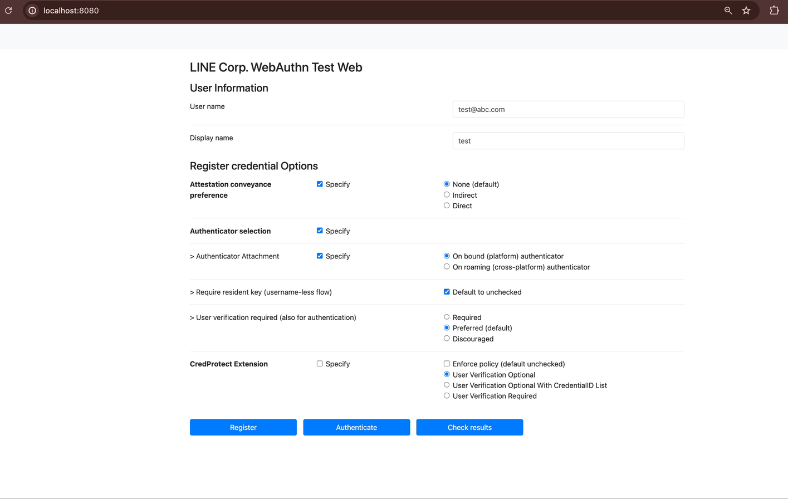
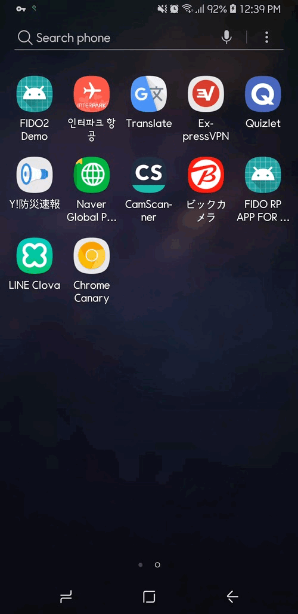

# LINE FIDO2 SERVER


> **FIDO2(WebAuthn) Server officially certified by FIDO Alliance**


## Overview

FIDO (Fast IDentity Online) is an open standard for online authentication. It is designed to solve the password problems stemming from a lot of security problems as we are suffering today.

Rather than relying on symmetric credentials (like passwords or PINs, typically which is a knowledge-based factor), FIDO is based on a public-key cryptography algorithm that is based on asymmetric credentials.

Simply, the device generates the key pair and stores the private key within the secure area, and sends the corresponding public key (as the name implies it is okay to be public) to the server.

Then, if the authentication is needed, the server sends challenges to the device and the device generates the digital signature with the private key and sends it to the server.

Finally, the server can validate the signature with the registered public key.

### What is FIDO2
FIDO2 is an improved standard for use on the web and other platforms as well as mobile. Various web browsers and OS platforms currently support the FIDO2 standard API.

Basically, FIDO2 has the following operations - Registration, Authentication.

#### Registration
- The user is prompted to choose an available FIDO authenticator that matches the online service’s acceptance policy.
- User unlocks the FIDO authenticator using a fingerprint reader, a button on a second–factor device, securely–entered PIN, or other methods.
- The user’s device creates a new public/private key pair unique for the local device, online service, and user’s account.
- The public key is sent to the online service and associated with the user’s account. The private key and any information about the local authentication method (such as biometric measurements or templates) never leave the local device.

#### Authentication
- Online service challenges the user to log in with a previously registered device that matches the service’s acceptance policy.
- User unlocks the FIDO authenticator using the same method as at Registration time.
- The device uses the user’s account identifier provided by the service to select the correct key and sign the service’s challenge.
- The client device sends the signed challenge back to the service, which verifies it with the stored public key and lets the user log in.

      
## Screenshots
### Chrome on Mac with TouchId


### Chrome on Mac with Secret Key (2FA)


### Chrome on Android with Fingerprint (Reg)


### Chrome on Android with Fingerprint (Auth)


## Modules
- server: The FIDO2 server implementation conforming to the FIDO2 standard
- common: FIDO2 related common models
- rp-server: The sample application with a FIDO2 RP implementation
- spring-boot-stater: The spring-boot-starter version of the LINE FIDO2 server application that can be easily integrated into a Spring Boot environment

## Features
- Supported attestation types
   - Basic
   - Self
   - Attestation CA (a.k.a Privacy CA)
   - None
   - Anonymization CA
- Supported attestation formats
   - Packed (FIDO2)
   - Tpm (Windows10 devices)
   - Android key attestation
   - Android SafetyNet (Any Android devices running 7+)
   - FIDO U2F (Legacy U2F authenticators)
   - Apple Anonymous
   - None
- Metadata service integration
   - FIDO MDSv2
   
## How to play with
You need to run the FIDO2 server and RP Server first.

If you want to integrate your own RP Server, please implement APIs by referring to the sample codes. Regarding client sides, you may implement the web app for communicating with the RP server.

We also provide our server in the form of a spring boot starter.
Check out the spring-boot-starter directory.

```bash
# Start RP Server
cd rpserver
./gradlew bootRun

# Start FIDO2 Server or Line-fido2-spring-boot Demo
cd server
./gradlew bootRun

cd spring-boot-starter/line-fido2-spring-boot-demo
./gradlew bootRun
```
### Local DB
FIDO2 Server running on local environments uses h2 as an embedded DB. This needs to be replaced with commercial standalone DB for other environments such as staging, beta or real.

In the case of the local environment, you can use the h2 console. Add the following path /h2-console to the fido server URL to access the h2 web console.

e.g., http://localhost:8081/h2-console

### Lombok
This project utilizes Lombok to reduce implementing getter/setter/constructors. You need the Lombok plugin to build with IntelliJ and Eclipse.
See the following web pages to get information.

https://projectlombok.org/

### Issues
- If data.sql doesn't work well in an IntelliJ environment,
  try commenting on this part in build.gradle.
```groovy
jar {
  processResources {
    exclude("**/*.sql")
  }
}
```

## API

### Swagger UI
After running the application, you can view the Swagger UI here.
- rpserver: http://localhost:8080/swagger-ui.html
- server: http://localhost:8081/swagger-ui.html


## References
`LINE Engineering Blogs`
- [FIDO at LINE: A First Step to a World Without Passwords](https://engineering.linecorp.com/en/blog/fido-at-line/)
- [FIDO at LINE: FIDO2 server as an open-source project](https://engineering.linecorp.com/en/blog/fido-at-line-fido2-server-opensource/)

`LINE DevDay Videos`
- [Strong customer authentication & biometrics using FIDO](https://youtu.be/S1y9wFh7_dc)
- [Cross Platform Mobile Security At LINE](https://youtu.be/4288h-EamTU)
- [Secure LINE login with biometric key replacing password](https://youtu.be/vCAu-y-iwyw)

`Internal`
- [Sequence Diagram](https://github.com/line/line-fido2-server/wiki/Sequence-diagrams)

`External`
- [FIDO2: WebAuthn & CTAP](https://fidoalliance.org/fido2/)
- [WebAuthn Level 2](https://www.w3.org/TR/2021/REC-webauthn-2-20210408/)
- [CTAP v2.1](https://fidoalliance.org/specs/fido-v2.1-ps-20210615/fido-client-to-authenticator-protocol-v2.1-ps-20210615.html)
